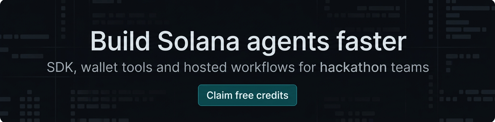

# Solana AI Agent Starter

A starter kit for building AI agents that can interact with Solana wallets, payments, and developer tools.

<!-- REPORENT-SPONSOR:START campaign=camp_demo_001 -->

[](https://devtoolx.example)

**Sponsored by [DevTool X](https://devtoolx.example)** - SDK, wallet tools and hosted workflows for hackathon teams. Claim free credits.

<!-- REPORENT-SPONSOR:END -->

## Features

- TypeScript agent runtime
- Wallet-aware tool calling
- Solana Devnet examples
- USDC payment demo
- Next.js frontend

## Getting started

```bash
npm install
npm run dev
```

## License

MIT
